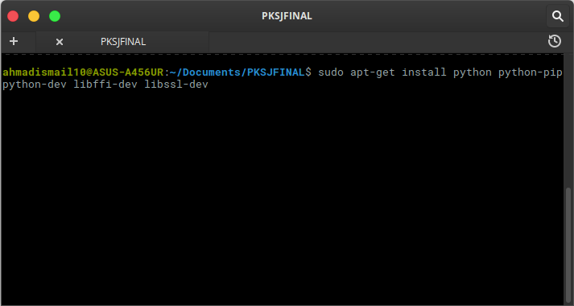
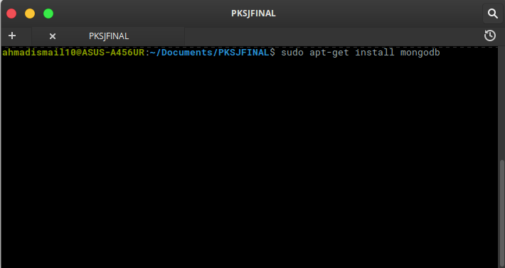
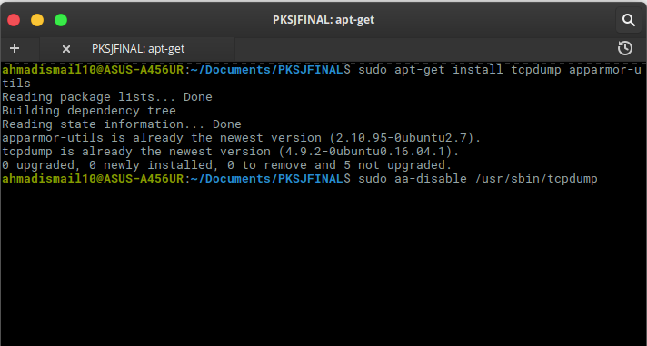
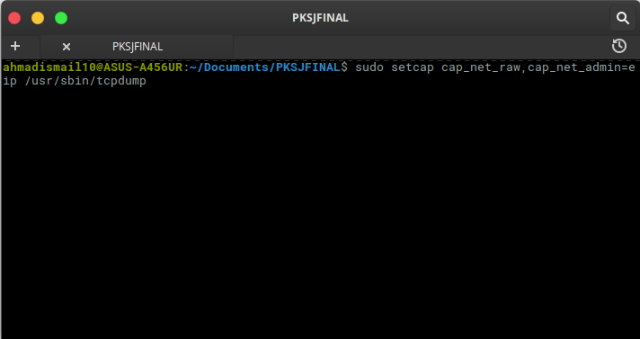
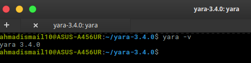
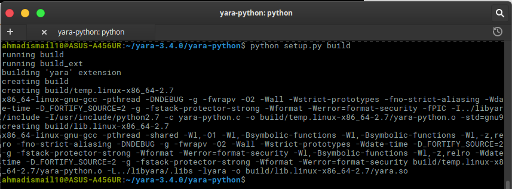
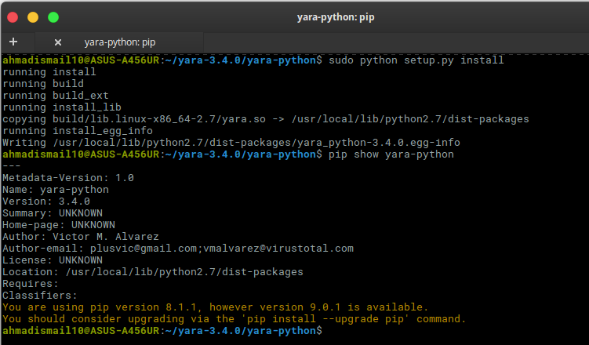
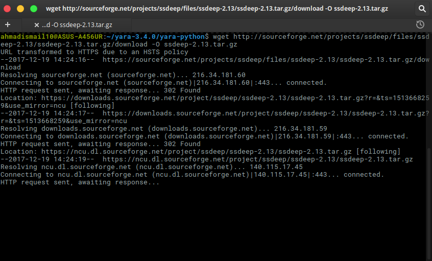
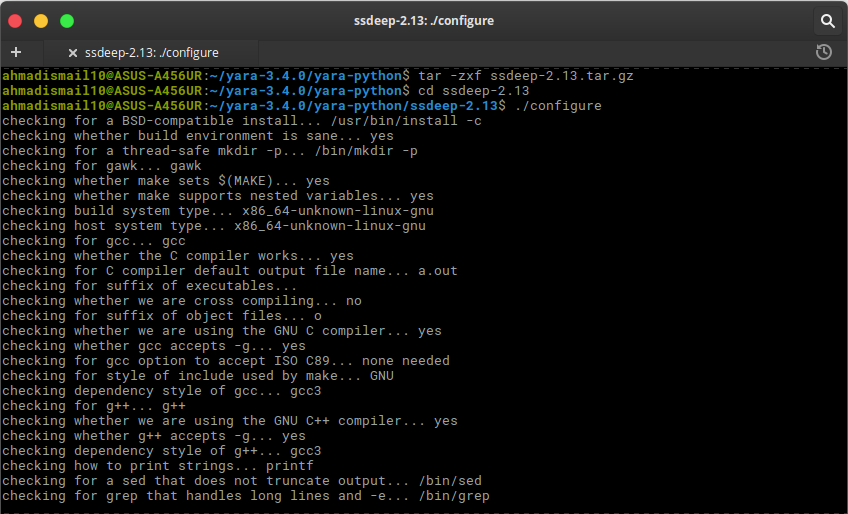
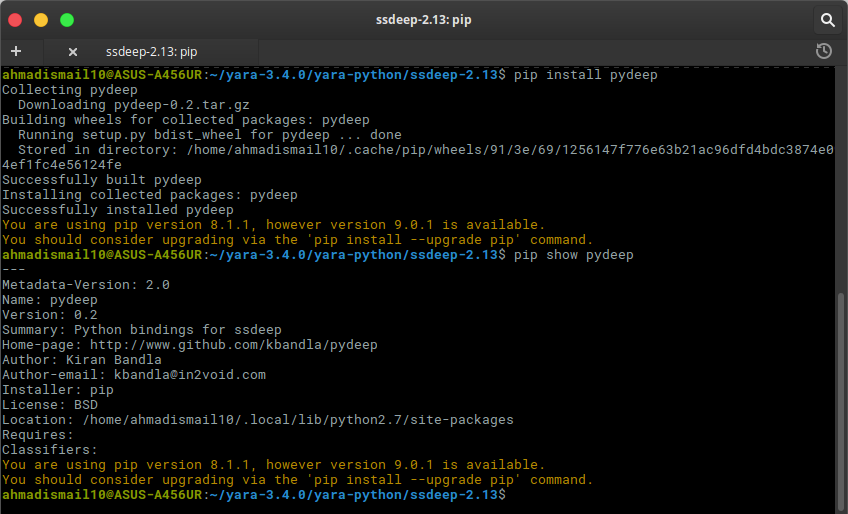

# Cuckoo Sandbox  
Cuckoo Sandbox adalah perangkat lunak open source untuk mengotomatisasi analisis file yang mencurigakan. Untuk melakukannya, gunakan komponen khusus yang memantau perilaku proses berbahaya saat berjalan di lingkungan yang terisolasi.  

## Requirements  
1. Installing Python Libraries  
```
$ sudo apt-get install python python-pip python-dev libffi-dev libssl-dev
$ sudo apt-get install python-virtualenv python-setuptools
$ sudo apt-get install libjpeg-dev zlib1g-dev swig
```

2. Install mongo-db untuk Django-Based Web Interface  
```
$ sudo apt-get install mongodb
```

3. Installing tcpdump
```
$ sudo apt-get install tcpdump apparmor-utils
$ sudo aa-disable /usr/sbin/tcpdump
```

4. Konfigurasi tcpdump
```
sudo setcap cap_net_raw,cap_net_admin=eip /usr/sbin/tcpdump
```

Lalu, bisa di verifikasi dengan ```getcap /usr/sbin/tcpdump``` maka akan keluar hasil seperti ini ```/usr/sbin/tcpdump = cap_net_admin,cap_net_raw+eip```
  
  
 
  
6. Install Ekstensi Yara-Python
```
$ cd yara-python  
$ python setup.py build  
$ sudo python setup.py install  
$ pip show yara-python  
```
  
  
7. Install Pydeep dan memvalidasinya
```
$ wget http://sourceforge.net/projects/ssdeep/files/ssdeep-2.13/ssdeep-2.13.tar.gz/download -O ssdeep-2.13.tar.gz
$ tar -zxf ssdeep-2.13.tar.gz
$ cd ssdeep-2.13
$ ./configure
$ make
$ sudo make install
$ ssdeep -V
$ pip install pydeep
$ pip show pydeep
```



