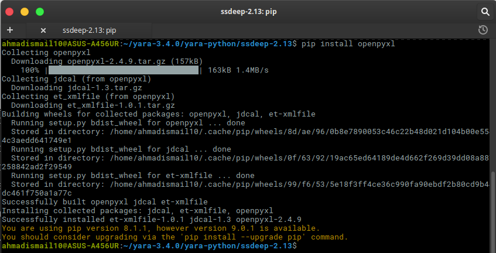

# Cuckoo Sandbox  
Cuckoo Sandbox adalah perangkat lunak open source untuk mengotomatisasi analisis file yang mencurigakan. Untuk melakukannya, gunakan komponen khusus yang memantau perilaku proses berbahaya saat berjalan di lingkungan yang terisolasi.(https://cuckoosandbox.org)  

## Requirements  
1. Installing Python Libraries  
```
$ sudo apt-get install python python-pip python-dev libffi-dev libssl-dev
$ sudo apt-get install python-virtualenv python-setuptools
$ sudo apt-get install libjpeg-dev zlib1g-dev swig
```
  
2. Install mongo-db untuk Django-Based Web Interface  
```
$ sudo apt-get install mongodb
```
  
3. Installing tcpdump  
```
$ sudo apt-get install tcpdump apparmor-utils
$ sudo aa-disable /usr/sbin/tcpdump
```
  
4. Konfigurasi tcpdump  
```
sudo setcap cap_net_raw,cap_net_admin=eip /usr/sbin/tcpdump
```
  
Lalu, bisa di verifikasi dengan ```getcap /usr/sbin/tcpdump``` maka akan keluar hasil seperti ini ```/usr/sbin/tcpdump = cap_net_admin,cap_net_raw+eip```
  
5. Install Yara  
```
$ sudo apt-get install autoconf libtool libjansson-dev libmagic-dev libssl-dev -y  
$ wget https://github.com/plusvic/yara/archive/v3.4.0.tar.gz -O yara-3.4.0.tar.gz  
$ tar -zxf yara-3.4.0.tar.gz  
$ cd yara-3.4.0  
$ ./bootstrap.sh  
$ ./configure --with-crypto --enable-cuckoo --enable-magic  
$ make  
$ sudo make install  
$ yara -v
```
   
  
 
  
6. Install Ekstensi Yara-Python  
```
$ cd yara-python  
$ python setup.py build  
$ sudo python setup.py install  
$ pip show yara-python  
```
  
  
7. Install Pydeep dan memvalidasinya  
```
$ wget http://sourceforge.net/projects/ssdeep/files/ssdeep-2.13/ssdeep-2.13.tar.gz/download -O ssdeep-2.13.tar.gz
$ tar -zxf ssdeep-2.13.tar.gz
$ cd ssdeep-2.13
$ ./configure
$ make
$ sudo make install
$ ssdeep -V
$ pip install pydeep
$ pip show pydeep
```


  
8. Menginstall prasyarat Volatility. Seperti openpyxl,ujson,pycrypto,distorm3,pytz  
```
$ pip install openpyxl
$ pip install ujson
$ pip install pycrypto
$ pip install distorm3
$ pip install pytz 
```
  
  
  
9. Install Volatility dan memvalidasinya
```
$ git clone https://github.com/volatilityfoundation/volatility.git
$ cd volatility
$ python setup.py build
$ python setup.py install
$ python vol.py -h
```  
  
  

## Install Cuckoo (HOST)
1. Install Cuckoo (untuk Host, kami menggunakan elementary OS 0.4.1 Loki (Built on "Ubuntu 16.04.3 LTS")  
```
$ sudo pip install -U pip setuptools
$ sudo pip install -U cuckoo
```
  
2. Menambahkan user cuckoo
```
$ sudo adduser cuckoo
```  
   

## Guest (Microsoft Windows XP Professional SP3)
Untuk Guest, kami menggunakan Virtualbox untuk install OS Windows XP
1. Instalasi virtualbox
```
$ sudo apt-get install vitualbox
```
  
2. Menambahkan user cuckoo pada virtualbox
```
$ sudo usermod -a -G vboxusers cuckoo
```
  
3. Membuat Virtual Machine dengan nama "windowsxp"
```
$ vboxmanage createvm --name "windowsxp" --ostype WindowsXP --register
$ vboxmanage modifyvm "windowsxp" --memory 1000 --acpi on --boot1 dvd --nic1 nat
$ vboxmanage createhd --filename "windowsxp.vdi" --size 12000
$ vboxmanage storagectl "windowsxp" --name "IDE Controller" --add ide --controller PIIX4
$ vboxmanage storageattach "windowsxp" --storagectl "IDE Controller" --port 0 --device 0 --type hdd --medium "windowsxp.vdi"
$ vboxmanage storageattach "windowsxp" --storagectl "IDE Controller" --port 0 --device 1 --type dvddrive --medium /home/ahmadismail10/Downloads/windowsxpsp3.iso
$ vboxmanage hostonlyif create
$ vboxmanage modifyvm "windowsxp" --nic1 hostonly
$ vboxmanage modifyvm "windowsxp" --hostonlyadapter1 vboxnet0
```
  
4. Membuat Shared-Folder dari Host menuju Guest
```
$ mkdir -p /home/ahmadismail10/.cuckoo/VMs/windowsxpshare
$ vboxmanage sharedfolder add "windowsxp" --name "windowsxpshare" --hostpath /home/ahmadismail10/.cuckoo/VMs/windowsxpshare --automount
$ cp /home/ahmadismail10/.cuckoo/agent/agent.py /home/ahmadismail10/.cuckoo/VMs/windowsxpshare/agent.py
```
  
  
5. Konfigurasi agar Koneksi Virtual Machine menjadi **Host Only Adapter**  
```
$ sudo iptables -A FORWARD -o eth0 -i vboxnet0 -s 192.168.56.0/24 -m conntrack --ctstate NEW -j ACCEPT
$ sudo iptables -A FORWARD -m conntrack --ctstate ESTABLISHED,RELATED -j ACCEPT
$ sudo iptables -A POSTROUTING -t nat -j MASQUERADE
$ sudo sysctl -w net.ipv4.ip_forward=1
```
  
6. Install Guest OS (Windows XP)  
```
$ vboxmanage startvm "windowsxp" 
```
    
7. Konfigurasi Jaringan Guest OS  
      
8. Mematikan Windows Update dan Windows Firewall  
      
      
9. Install Python pada guest OS  
Download terlebih dahulu, melalui internet-explorer pada guest OS. masuk ke halaman https://www.python.org/downloads/ kemudian install
    
10. Mengaktifkan Shared Folder dengan Host
- Klik Device -> Insert guest addition CD Image
  
- My Computer -> My Network Places -> Add a network place
- Click Browse
- windowsxpshare on Vboxsrv
  
11. Pindahkan file **agent.py** yang ada di share folder ke  ```C:\\Documents and Settings\All Users\Start Menu\Programs\Startup``` 
  
12. reboot Virtual Machine
Lalu, buka cmd melalui Start Menu -> run -> ketik cmd lalu klik run. Kemudian ketik ```netstat -ab``` agar mengetahui apakah port 8000 yang disetting pada agent.py berjalan
  
13. Snapshot
```
$ vboxmanage snapshot "windowsxp" take "snapshot1" --pause
$ vboxmanage controlvm "windowsxp" poweroff
$ vboxmanage snapshot "windowsxp" restorecurrent
```
  

## Konfigurasi Cuckoo

Masuk ke folder conf. untuk path kami di ```/home/ahmadismail10/.cuckoo/conf/```
1. Cuckoo.conf 
```
machinery = virtualbox
[resultserver]
ip = 192.168.56.1 #This is the IP address of the host
port = 2042 #leave default unless you have services running
```
2. auxiliary.conf
```
[sniffer]
# Enable or disable the use of an external sniffer (tcpdump) [yes/no].
enabled = yes

# Specify the path to your local installation of tcpdump. Make sure this
# path is correct.
# You can check this using the command: whereis tcpdump
tcpdump = /usr/sbin/tcpdump

# Specify the network interface name on which tcpdump should monitor the
# traffic. Make sure the interface is active.
```
3. virtualbox.conf
```
# The ifconfig command will show you the interface name.
interface = vboxnet0
machines = windowsxp

[windowsxp]
label = windowsxp
platform = windows
ip = 192.168.56.10 # IP address of the guest
snapshot = snapshot1 # name of snapshot
```
4. reporting.conf
```
[mongodb]
enabled = yes
```

## Menjalankan Cuckoo
1. Run Cuckoo
ketik ```$ cuckoo``` pada terminal
  
2. Run Cuckoo pada web interface
ketik ```$ cuckoo web runserver 0.0.0.0:8000```
  
  
