#Snort
Snort adalah sebuah software yang berguna untuk mengamati aktivitas dalam suatu jaringan komputer. Snort dapat digunakan sebagai suatu Network Intrusion Detection System (NIDS) yang berskala ringan (lightweight).(ref:[https://almaspens.wordpress.com/2016/04/03/snort/](https://almaspens.wordpress.com/2016/04/03/snort/))  

##Instalasi  
## Instalasi dependency    
Perintah: `apt-get install openssh-server ethtool build-essential libpcap-dev libpcre3-dev libdumbnet-dev bison flex zlib1g-dev liblzma-dev openssl libssl-dev`  
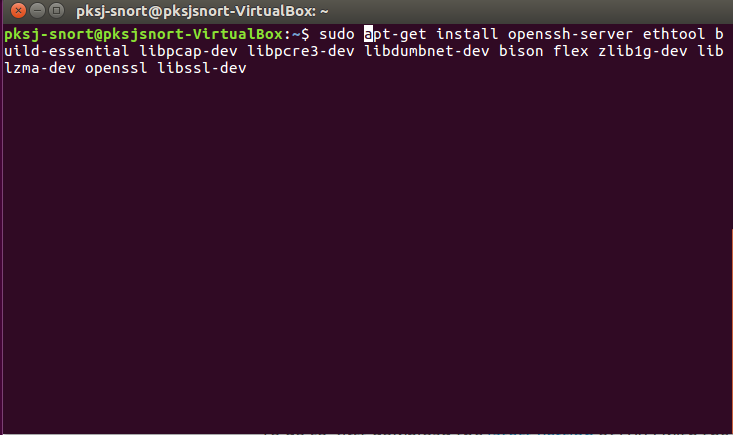  
###Instalasi DAQ  
1. Download DAQ  
`wget https://www.snort.org/downloads/snort/daq-2.0.6.tar.gz`  
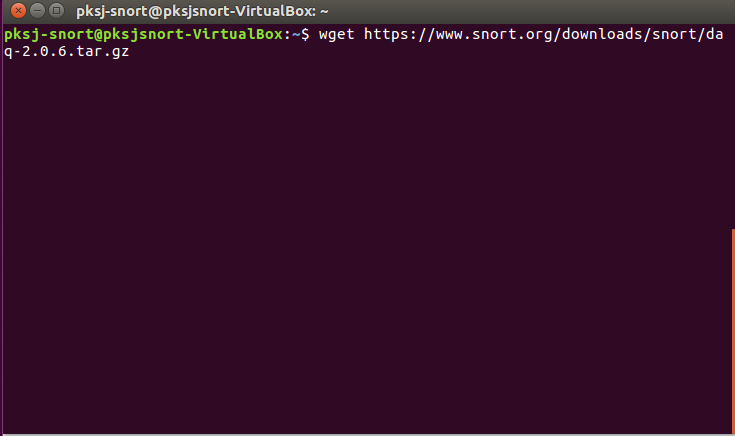  
2. Ekstrak DAQ    
`wget https://www.snort.org/downloads/snort/daq-2.0.6.tar.gz`    
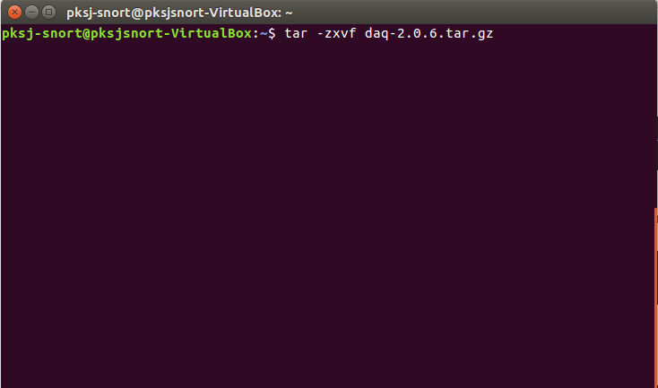  
3. Compile dan install DAQ    
`./configure `  
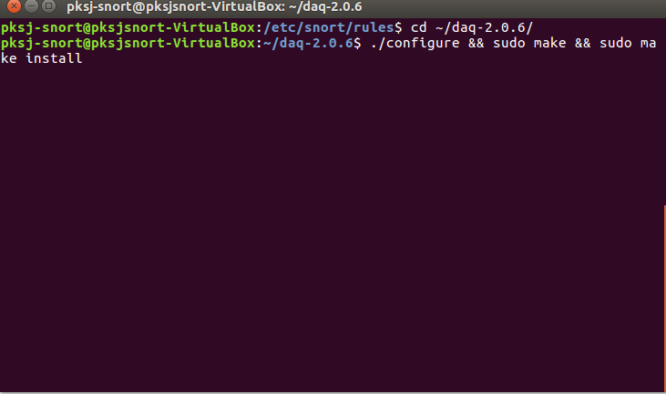  

###Instalasi Snort  
1. Download snort    
`wget https://www.snort.org/downloads/snort/snort-2.9.11.tar.gz`  
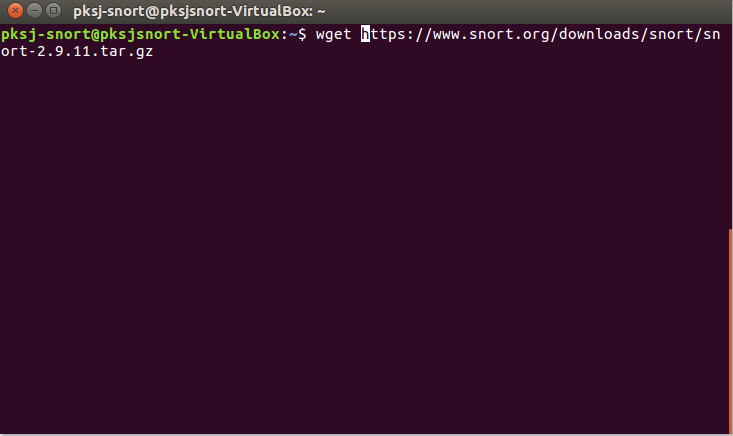  
2. Ekstrak snort  
`tar -xzvf snort-2.9.11.tar.gz`  
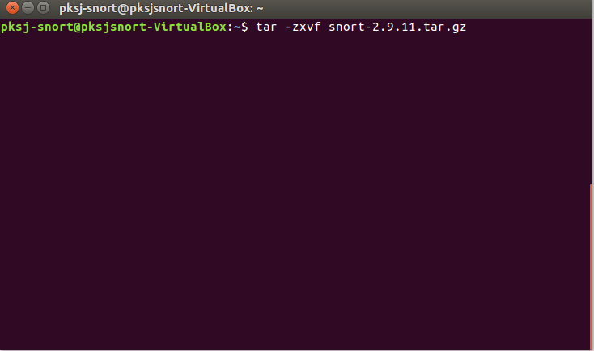  
3. Compile dan install snort  
`./configure --enable-sourcefire && sudo make && sudo make install`  
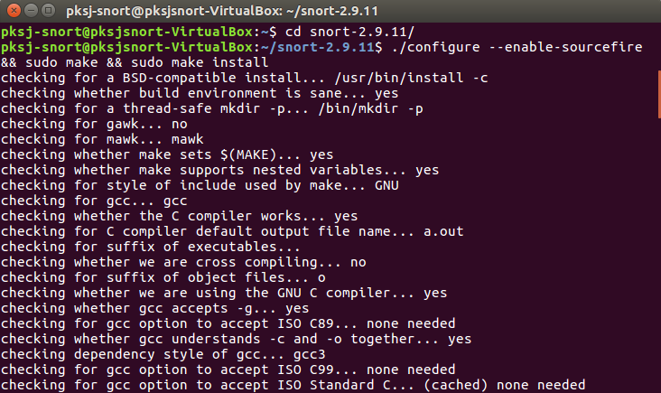  
4. Update shared libary dan buat link  
	- `ldconfig`
	- `sudo ln  -s /usr/local/bin/snort /usr/sbin/snort`      
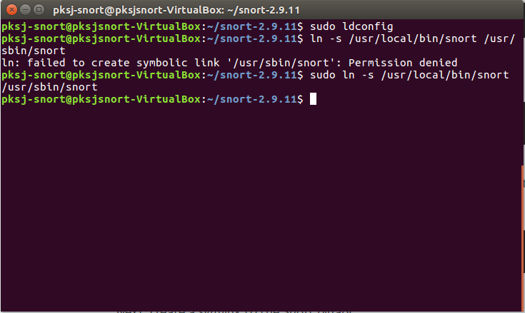  
5. Verifikasi instalasi  
`snort -V`  
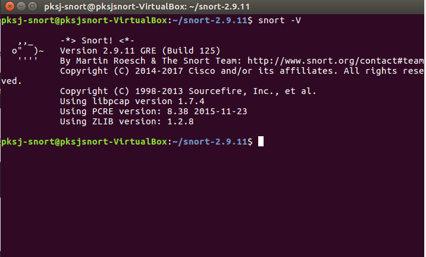  

###Konfigurasi  
1. Buat folder yang dibutuhkan
	1. `sudo mkdir /etc/snort`  
	2. `sudo mkdir /etc/snort/preproc_rules`  
	3. `sudo mkdir /etc/snort/rules`  
	4. `sudo mkdir /var/log/snort`  
	5. `sudo mkdir /usr/local/lib/snort_dynamicrules`  
	6. `sudo touch /etc/snort/rules/white_list.rules`  
	7. `sudo touch /etc/snort/rules/black_list.rules`  
	8. `sudo touch /etc/snort/rules/local.rules`  
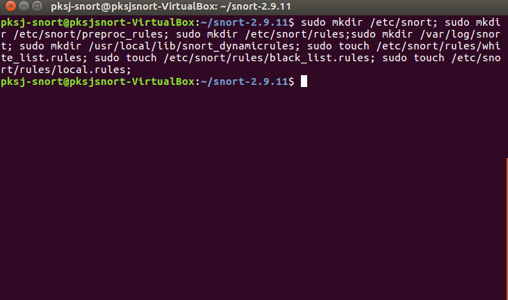  
2. Ubah permission  
	1. `sudo chmod -R 5775 /etc/snort/`  
	2. `sudo chmod -R 5775 /var/log/snort/`  
	3. `sudo chmod -R 5775 /usr/local/lib/snort`  
	4. `sudo chmod -R 5775 /usr/local/lib/snort_dynamicrules/`  
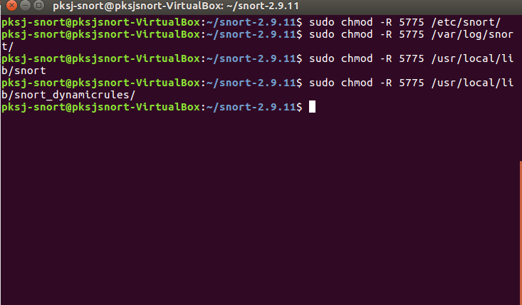
3. Pindah ke folder ~/snort-2.9.11/etc lalu copy file  
`sudo cp -avr *.conf *.map *.dtd /etc/snort`      
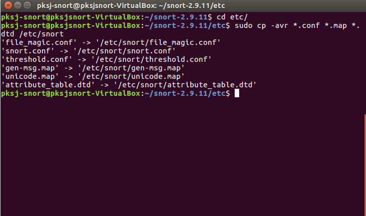  
4. Copy dynamicpreprocessor file  
`sudo cp -avr src/dynamic-preprocessors/build/usr/local/lib/snort_dynamicpreprocessor/* /usr/local/lib/snort_dynamicpreprocessor/`  
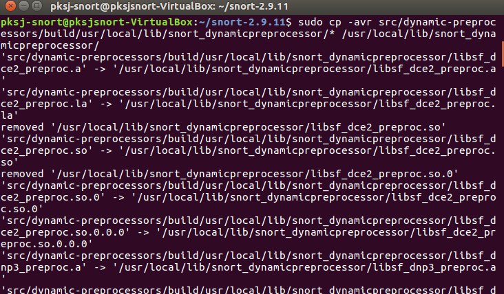
5. Comment semua rules  
`sudo sed -i "s/include \$RULE\_PATH/#include \$RULE\_PATH/" /etc/snort/snort.conf `    
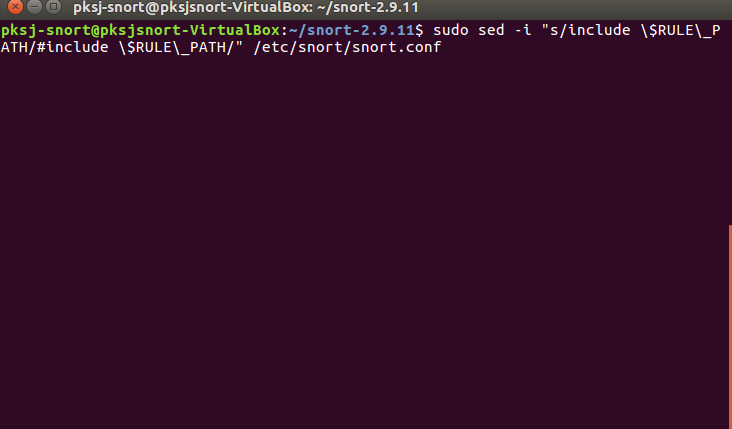
6. Edit file konfigurasi snort  
`sudo gedit /etc/snort/snort.conf`    
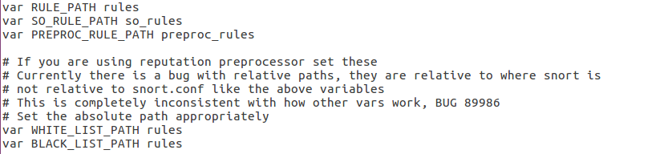  
  
7. Validasi setting  
`snort -T -i enp0s3 -c /etc/snort/snort.conf`  
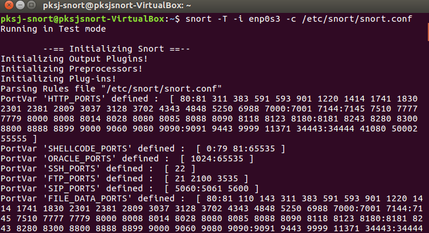
8. Apabila pengaturan yang kita masukkan benar maka akan muncul tampilan seperti di bawah:  
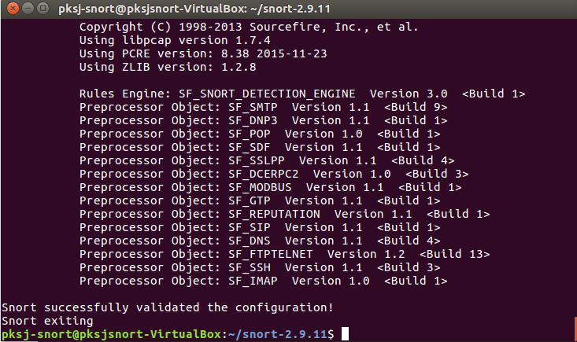

#### Menambahkan rules  
1. Download rule  
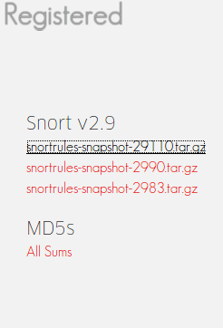  
2. Extract file yang telah kita download  
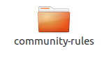  
Buka file tersebut lalu copy file rules ke **/etc/snort**  
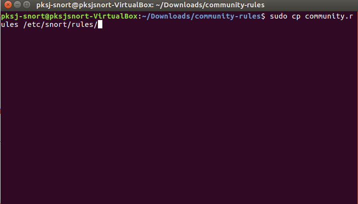  
3. Copy file konfigurasi snort  
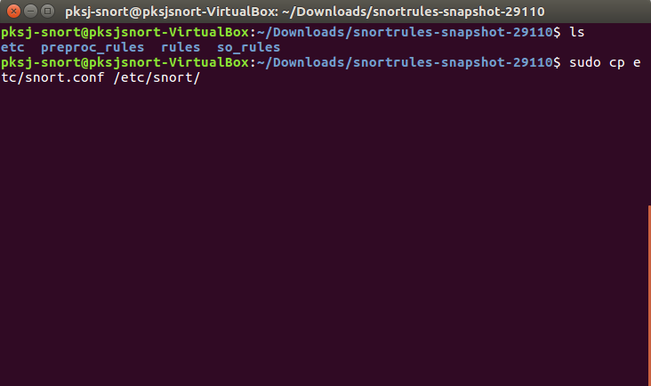

### Testing  
#### Skenario 1  
1. Membuat rules sederhana  
`sudo gedit /etc/snort/rules/local.rules`  
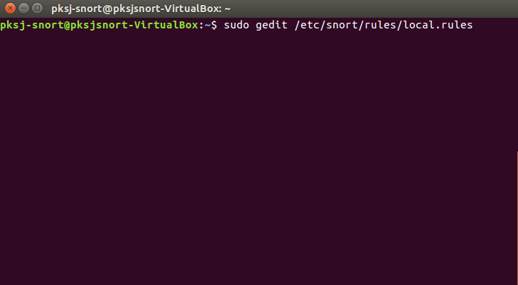  
2. Masukkan rules sederhana    
	1. `alert tcp any any -> $HOME_NET 21 (msg:"FTP connection attempt"; sid:1000001; rev:1;)`  
	2. `alert icmp any any -> $HOME_NET any (msg:"ICMP connection attempt"; sid:1000002; rev:1;) `  
	3. `alert tcp any any -> $HOME_NET 80 (msg:"TELNET connection attempt"; sid:1000003; rev:1;)`  
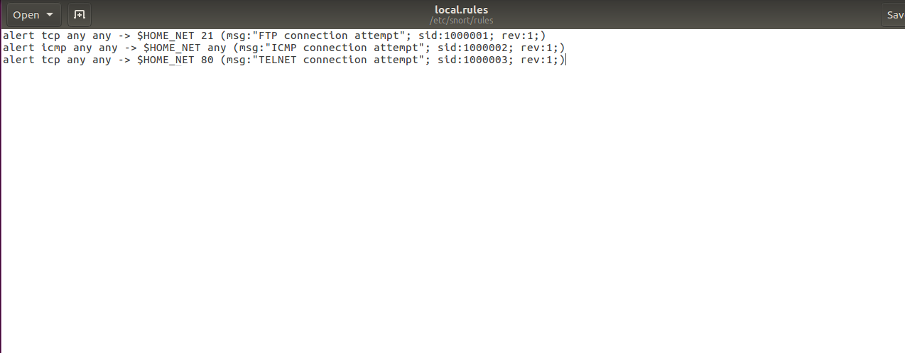  
3. Lihat ip dari server snort  
`ifconfig`  
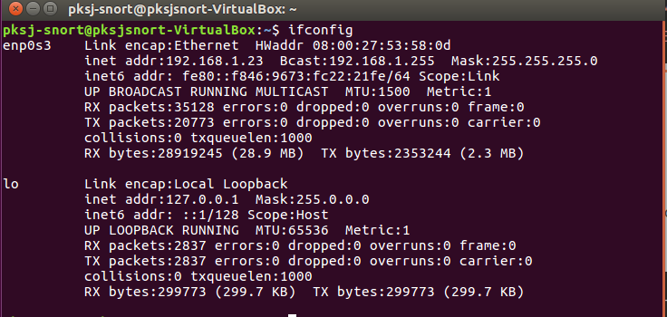
4. Mulai snort  
`snort snort -A console -q -c /etc/snort/snort.conf -i enp0s3`  
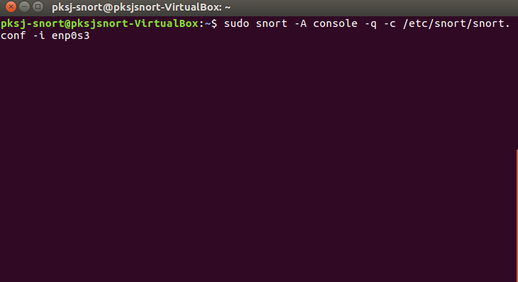  
3. Ping dari host lain  
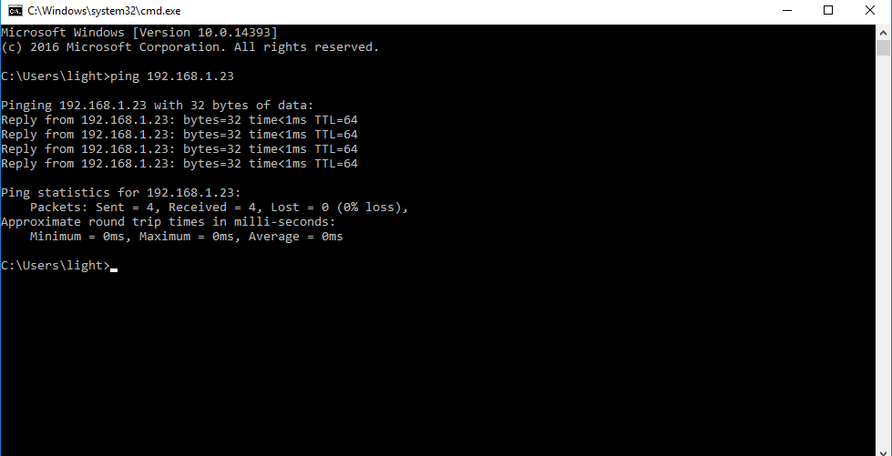  
4. Lihat log di server snort  
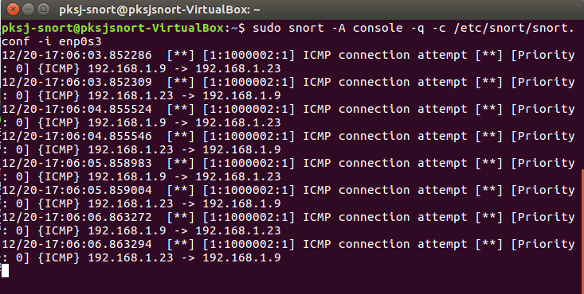

#### Sekanrio 2
1. Membaca file pcap dengan perintah `sudo snort -r maccdc2012_00000.pcap` 
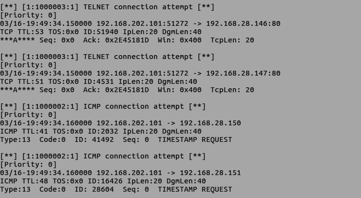

